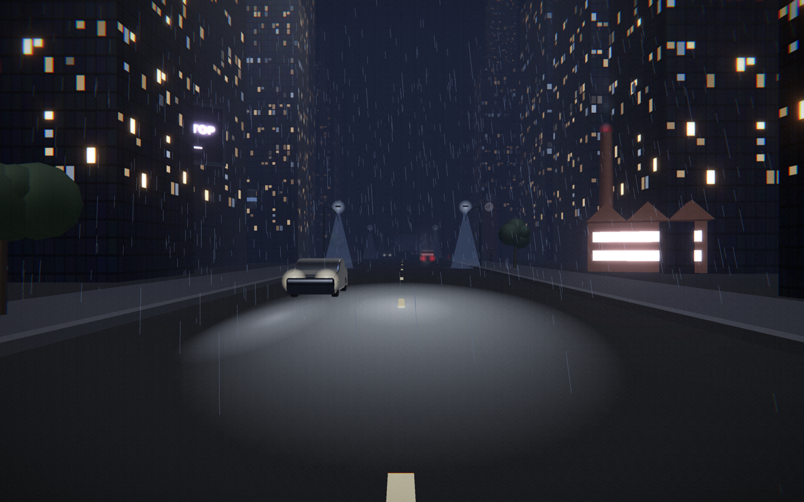
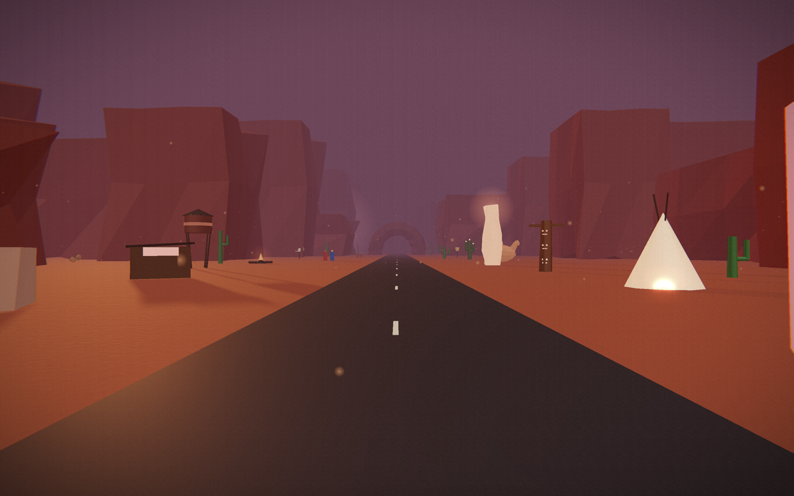
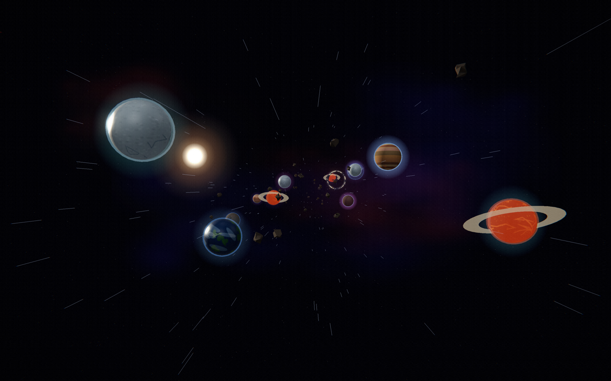
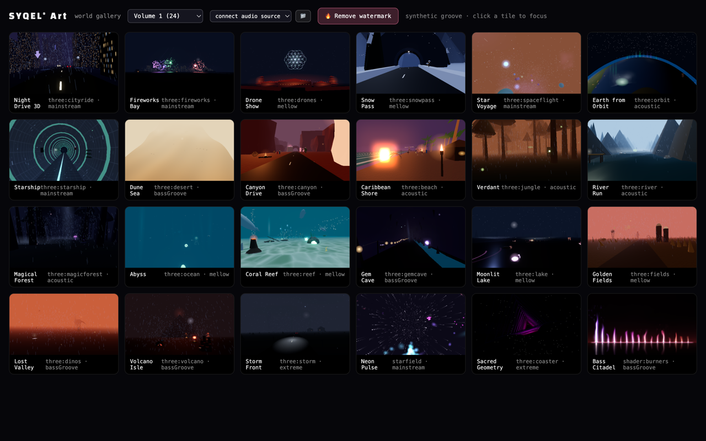

# SYQEL&reg; Art

### Endless audio-reactive 3D worlds that travel with your music.

Night drives, star voyages, deserts, jungles, oceans — a journey-driven spatial music
visualizer that turns **whatever you're already playing** into a living world.

 

**Get it from the stores**

**…or download directly**

 

---

## What is it?

SYQEL Art listens to your computer's audio — **Spotify, Apple Music, YouTube, a DJ set, a
livestream, anything** — and renders an endless, cinematic 3D world that moves with the music.
No microphone, no setup, no uploads. Press play on your music and the room becomes a journey.

It's not a single loop on repeat: an internal **Director** travels the catalogue, blending one
world into the next so a long session never feels the same twice.

## Why you'll love it

- 🎧 **Works with any audio source** — captures system audio directly. **No mic prompt**, no virtual cables.
- 🌌 **24+ handcrafted worlds, two volumes** — Night Drive, Canyon Drive, Starfarer, Midnight Drive, Coral Reef, Star Voyage, Neon Pulse, Sacred Geometry… and more landing over time.
- 🎬 **A journey, not a screensaver** — the Director roams and cross-fades worlds to the energy of your music.
- 🖥️ **Full-screen, full-quality** — native GPU rendering through the complete PostFX finishing pass.
- ⚡ **Auto-updating** — the desktop app quietly updates itself; new worlds just appear.
- 🔒 **Private by design** — audio is analyzed locally and never leaves your machine.

## A few of the worlds

| | |
|:--:|:--:|
|  |  |
| **Canyon Drive** | **Starfarer** |
|  |  |
| **Midnight Drive** *(Vol. 2)* | **The world gallery** |

## Download & install

**From an app store** — auto-updating and store-managed:

- 🍎 **[Mac App Store](https://apps.apple.com/us/app/syqel-art-music-visualizer/id6783419598)**
- 🪟 **[Microsoft Store](https://apps.microsoft.com/detail/9PDTLHTGRMDS)**

**Or download directly** from **[Releases](https://github.com/SYQEL/SYQEL-Art-Releases/releases/latest)**:

| Platform | File | Requirements |
|---|---|---|
| **macOS** (Apple Silicon + Intel) | `.dmg` | macOS 13 (Ventura) or later |
| **Windows** | `.exe` installer | Windows 10/11 (64-bit) |

The direct macOS build is **notarized** and the Windows build is **code-signed**, so they install cleanly.
On first launch, pick **System Audio** as your source, start your music, and go full screen. ✨

> Prefer not to install anything? The full experience also runs in your browser at **[syqel.art](https://syqel.art)**.

## Updates

The desktop app checks for new versions on launch and updates itself in place — no reinstalling.
Each release here ships signed installers plus the update manifest the app reads automatically.

## Support

- 🌐 Web app & info: **[syqel.art](https://syqel.art)**
- 💬 Issues / feedback: open an issue on this repo
- ✉️ Manage your subscription from inside the app

---

Made with sound and light by **SYQEL&reg; INC**

